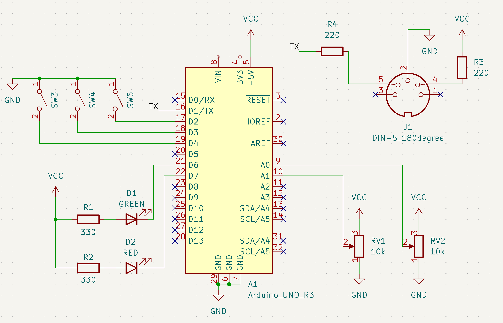

# Fun With MIDI

Find my links on h-e.io

If you like MIDI too, check out Grandbot: https://github.com/handeyeco/Grandbot

---

Hey 👋 My name is Matthew and I don't understand analog circuits.

Boy have I tried though. Just looking around my desk I can see my copy of There Are No Elections by Amdahl, Practical Electronics For Inventors by Scherz, and Electronic Projects For Musicians by Anderton. My degree is in Music Business, Performance, and Technology and I've worked TWO jobs assembling modular synthesizers - one before and one after my career as an audio engineer before I made the switch to software development.

Circuits are hard. I discovered something though - on my 100th attempt at learning electrical engineering - that there's buckets of fun to be had with a relatively simple little circuit and some basic programming skills.

In this article I'm going to talk a little about MIDI.

## What I'm using

For these examples I'm using an Arduino (~$50) and the Sparkfun MIDI Shield (~$24). If you want to follow along and have the cash, I highly recommend throwing some dough at both Arduino and Sparkfun - they contribute a lot to the DIY scene. However you can get equally far with a $10 Arduino knock-off and some common components.

## The circuit

Even though MIDI in makes everything more fun, for the sake of simplicity I'm just using MIDI out, two potentiometers, three buttons, and two LEDs. You can see the Sparkfun MIDI Shield schematic on their site, but the parts I'm using are:

- MIDI out, which is just a 5 pin DIN socket with two resistors
- Two potentiometers acting as voltage dividers going into analog pins on the Arduino
- Three switches going into digital pins on the Arduino (we'll be using the internal pull-up resistors)
- Two LEDs with current limiting resistors

If you've been playing with electronics already, there's a good chance you have most of this stuff lying around with the exception of the Arduino and the DIN socket (using a 3.5mm jack for TRS MIDI is also an option).

## Sketch #1: Board Test

