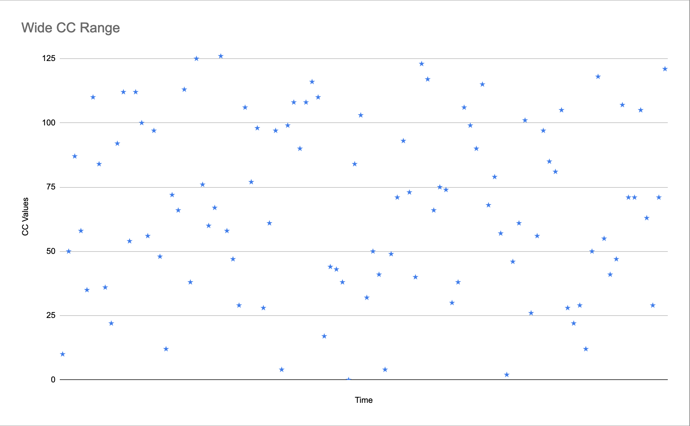
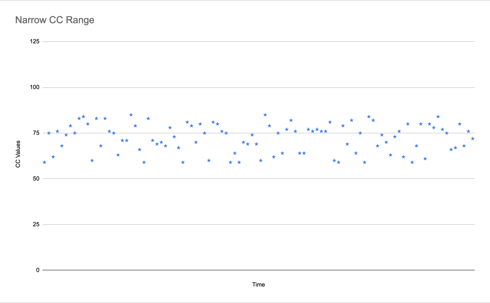
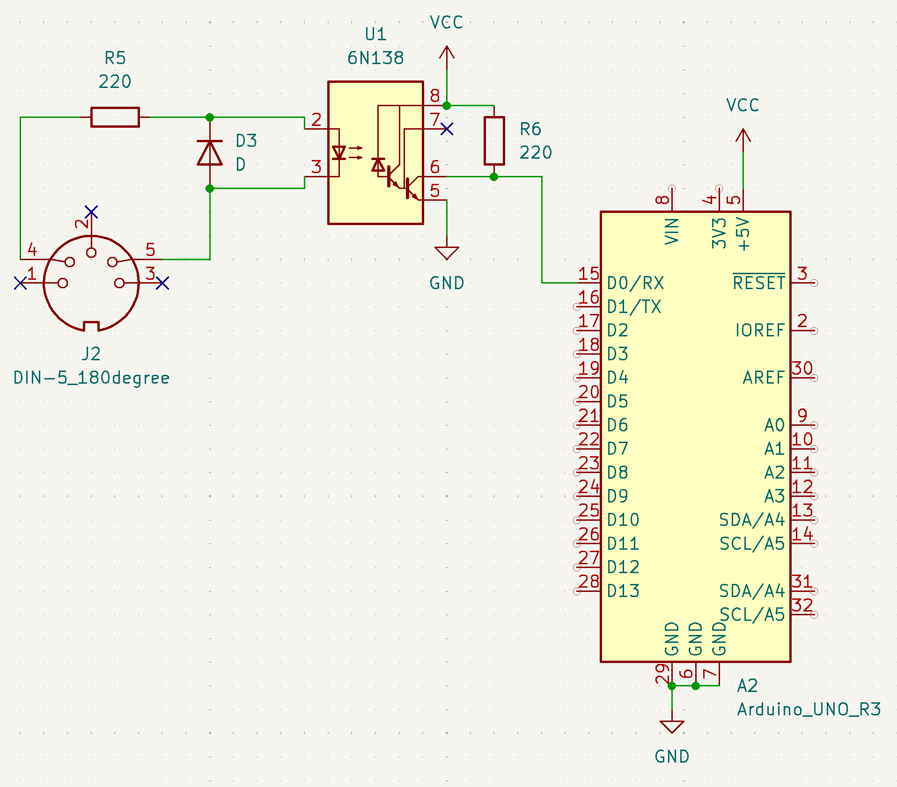

# Fun With MIDI

Find my links on h-e.io

If you like MIDI, check out my project Grandbot: https://github.com/handeyeco/Grandbot

---

Hey 👋 My name is Matthew and I don't understand analog circuits.

Boy have I tried though. Just looking around my desk I can see my copy of There Are No Elections by Amdahl, Practical Electronics For Inventors by Scherz, and Electronic Projects For Musicians by Anderton. My degree is in Music Business, Performance, and Technology and I've worked TWO jobs assembling modular synthesizers - one before and one after my career as an audio engineer, before I made the switch to software development.

Circuits are hard. I discovered something though - on my 100th attempt at learning electrical engineering - that there's buckets of fun to be had with a relatively simple circuit and some basic programming skills.

In this article I'm going to talk a little about MIDI.

## What I'm using

For these examples I'm using an Arduino (~$50) and the Sparkfun MIDI Shield (~$24). If you want to follow along and have the cash, I highly recommend throwing some dough at both Arduino and Sparkfun - they contribute a lot to the DIY scene. However you can get equally far with a $10 Arduino knock-off and some common components.

## The circuit

Even though MIDI in makes everything more fun, for the sake of simplicity I'm just using MIDI out, two potentiometers, three buttons, and two LEDs. You can see the Sparkfun MIDI Shield schematic on their site, but the parts I'm using for these examples are:


- MIDI out, which is just a 5 pin DIN socket with two resistors
- Two potentiometers acting as voltage dividers going into analog pins on the Arduino
- Three switches going into digital pins on the Arduino (we'll be using the internal pull-up resistors)
- Two LEDs with current limiting resistors

If you've been playing with electronics already, there's a good chance you have most of this stuff lying around with the exception of the Arduino and the DIN socket (using a 3.5mm jack for TRS MIDI is also an option).

## Sketch #1: Board Test

Source: https://github.com/handeyeco/fun-with-midi/blob/main/board-test/board-test.ino

This first sketch is just testing the pots, buttons, and LEDs. First we let the program know which pins to find everything:

``` Arduino
// button pins (digital)
byte S3_PIN = 4;
byte S4_PIN = 3;
byte S5_PIN = 2;

// pot pins (analog)
byte RV1_PIN = A1;
byte RV2_PIN = A0;

// LED pins (digital)
byte GRN_LED_PIN = 6;
byte RED_LED_PIN = 7;
```

Then we declare some state so we can keep track of what everything is doing as the sketch runs:

``` Arduino
// declare read state
bool S3_STATE = 1;
bool S4_STATE = 1;
bool S5_STATE = 1;
int RV1_STATE = 0;
int RV2_STATE = 0;
```

`setup` is the code that runs at the beginning of the sketch:

``` Arduino
void setup() {
  // setup for printing to our monitor
  Serial.begin(9600);

  // the switches us the built-in pull-up resistors
  pinMode(S3_PIN, INPUT_PULLUP);
  pinMode(S4_PIN, INPUT_PULLUP);
  pinMode(S5_PIN, INPUT_PULLUP);

  // the pots don't use the pull-up resistors
  pinMode(RV1_PIN, INPUT);
  pinMode(RV2_PIN, INPUT);

  // then set up the LEDs as outputs
  pinMode(GRN_LED_PIN, OUTPUT);
  pinMode(RED_LED_PIN, OUTPUT);

  // do an initial read of everything
  // so we can start looking for changes
  S3_STATE = digitalRead(S3_PIN);
  S4_STATE = digitalRead(S4_PIN);
  S5_STATE = digitalRead(S5_PIN);
  RV1_STATE = analogRead(RV1_PIN);
  RV2_STATE = analogRead(RV2_PIN);
}
```

`loop` runs over and over again so we can watch for changes:

``` Arduino
// pot change threshold,
// for what we consider a change
int RV_THRESH = 3;

void loop() {
  // read pins
  bool S3_READ = digitalRead(S3_PIN);
  bool S4_READ = digitalRead(S4_PIN);
  bool S5_READ = digitalRead(S5_PIN);
  int RV1_READ = analogRead(RV1_PIN);
  int RV2_READ = analogRead(RV2_PIN);

  // if any button is pressed, light LED
  bool pressed = S3_READ && S4_READ && S5_READ;
  digitalWrite(GRN_LED_PIN, pressed);
  digitalWrite(RED_LED_PIN, pressed);

  // print and update state
  // if a change is detected
  if (S3_READ != S3_STATE) {
    Serial.println("S3");
    S3_STATE = S3_READ;
  }
  if (S4_READ != S4_STATE) {
    Serial.println("S4");
    S4_STATE = S4_READ;
  }
  if (S5_READ != S5_STATE) {
    Serial.println("S5");
    S5_STATE = S5_READ;
  }
  if (abs(RV1_READ - RV1_STATE) > RV_THRESH) {
    Serial.println("RV1");
    RV1_STATE = RV1_READ;
  }
  if (abs(RV2_READ - RV2_STATE) > RV_THRESH) {
    Serial.println("RV2");
    RV2_STATE = RV2_READ;
  }
}
```

What it's doing:

1. If any buttons are pressed, light up the LEDs
2. If any buttons are pressed, print in the serial monitor which button was pressed
3. If any pots are turned, print in the serial monitor which pot was turned

Okay, not super fun so far, but we hopefully we have a working Arduino connected to a working MIDI shield. Now let's actually _do_ something with the MIDI output.

## Sketch #2: MIDI CC Controller

Source: https://github.com/handeyeco/fun-with-midi/blob/main/cc-controller/cc-controller.ino

I'm not going to explain MIDI or MIDI CC in a lot of detail. You have access to the internet. I'm just going to say that MIDI is how digital music devices communicate with one another and MIDI CC is how we control parameters on one device from another device.

This script will give us the power to change parameters on a remote device from our Arduino. Imagine being able to change the filter cutoff on your synth from the other side of the room - that _can_ be a reality for you!

The code is much more concise as it takes the code from the last example and cuts a lot away from it. We're only going to use the pots here:

- One pot will control which CC to control. For instance on the Hydrasynth, filter 1 cutoff is MIDI CC 74 and LFO 1 rate is MIDI CC 72.
- The other pot will control the value of the MIDI CC. Most of MIDI works with 7 bits which gives us a range between 0 and 127 (128 steps).

First we import FortySevenEffects' MIDI library (https://github.com/FortySevenEffects/arduino_midi_library) and initialize it:

``` Arduino
#include <MIDI.h>

MIDI_CREATE_DEFAULT_INSTANCE();
```

We set pins and initalize state like before; this time though we also have to start the MIDI library. Additionally I've added a helper function to map 0-1023 (the full range that an Arduino's `analogRead` can supply) to 0-127 (the full range that MIDI can use).

``` Arduino
// pot pins
byte RV1_PIN = A1;
byte RV2_PIN = A0;

// declare read state
int RV1_STATE = 0;
int RV2_STATE = 0;

int read_and_map(byte pin) {
  int read = analogRead(pin);
  return map(read, 0, 1023, 0, 127);
}

void setup() {
  MIDI.begin(MIDI_CHANNEL_OMNI);

  // set pin modes
  pinMode(RV1_PIN, INPUT);
  pinMode(RV2_PIN, INPUT);

  // initialize read state
  RV1_STATE = read_and_map(RV1_PIN);
  RV2_STATE = read_and_map(RV2_PIN);
}
```

Now the juicy bit:

``` Arduino
// there are 16 MIDI channels,
// I just used the first one
byte MIDI_CH = 1;

void loop() {
  // read pins
  int RV1_READ = read_and_map(RV1_PIN);
  int RV2_READ = read_and_map(RV2_PIN);

  // RV1 adjusts which CC channel we're changing
  if (RV1_READ != RV1_STATE) {
    RV1_STATE = RV1_READ;
  }
  // RV2 adjusts the CC value
  if (RV2_READ != RV2_STATE) {
    RV2_STATE = RV2_READ;
    // sendControlChange(CC, value, channel)
    MIDI.sendControlChange(RV1_STATE, RV2_STATE, MIDI_CH);
  }
}
```

What this sketch does:

- It watches for changes on the RV1 potentiometer and if it changes we change the MIDI CC we're going to adjust
- It watches for changes on the RV2 potentiometer and if it changes we send a MIDI CC message to our MIDI output using the MIDI CC from RV1 and the value from RV2

In theory we could use RV1 to go to MIDI CC 74 then use RV2 to adjust the filter cutoff on our Hydrasynth. Or use RV1 to go to MIDI CC 81 then use RV2 to adjust envelope 1 attack.

In practice this is a little tough because we don't have a display to tell us what MIDI CC we're on. For now we could use an app like MIDI Monitor to see our work in action and later we could add a cheap I2C OLED screen to tell us what's happening.

## Sketch #3: Random CC

Source: https://github.com/handeyeco/fun-with-midi/blob/main/random-cc/random-cc.ino

Let's go one step further and make something that's actually fun to use without adding a screen or connecting it to a computer. Modular folks think they have all the fun with their bleeps and their bloops and their endless modulation options, but now that we know we can control synths using MIDI CC, we can make our own obnoxious sounds!

Here's what this sketch is going to do:

- We're going to pick a MIDI CC and start sending it random values.
- RV2 will determine how often we send a random value: really fast or really slow.
- RV1 will do different things based on the buttons:
  - When we press S3 we'll turn off all the LEDs and RV1 will change the offset of the MIDI CC. MIDI CC works between 0 and 127; offset will set the lowest possible value our random CC generator will send.
  - When we press S4 we'll turn on the green LED and RV1 will now change the depth of the MIDI CC. This essentially will set the highest possible value our random CC generator will send.
  - When we press S5 we'll turn on the red LED and RV1 will now change the MIDI CC that we're sending to. Basically chosing what parameter we want to control.

So when "offset" is 0 and "depth" is 127, we'll get random CCs between 0 and 127. When "offset" is 64 and "depth" is 127, we'll get random CCs between 64 and 127 (we'll clamp the maximum output to 127 since that's the max MIDI CC can handle). When "offset" is 64 and "depth" is 10, we'll get random CCs between 64 and 74.

So by default we'll generate random CCs using the full CC range:



But we can narrow that range using offset and depth:



This code shares a lot from the first two examples, so I'm just going to talk about the important changes. First we initialize some state:

``` Arduino
// what editing mode we're in:
// 0 = offset (no LEDs)
// 1 = depth (green LED)
// 2 = CC (red LED)
byte RV1_edit_mode = 0;

// offset is our lowest possible CC
int offset = 0;
// depth is how far from
// the lowest CC we can go
int depth = 127;
// the MIDI CC we're sending values for
// 74 is commonly the CC for filter cutoff
byte cc = 74;

// these are used to set our
// MIDI message interval
int MIN_SPEED = 60;
int MAX_SPEED = 1000;
int speed = MAX_SPEED;
unsigned long last_cc_sent = 0;
```

Next we check each button to see if they have been pressed and if we detect a change we update the mode we're in, for example:

``` Arduino
  byte old_RV1_edit_mode = RV1_edit_mode;

  // update edit state if button change detected
  if (S3_READ != S3_STATE) {
    S3_STATE = S3_READ;
    // set RV1_edit_mode to offset
    if (S3_STATE == LOW) {
      RV1_edit_mode = 0;
    }
  }

  // ...same for the other buttons...

  // watch for changes to edit mode and update LEDs
  if (old_RV1_edit_mode != RV1_edit_mode) {
      digitalWrite(GRN_LED_PIN, RV1_edit_mode != 1);
      digitalWrite(RED_LED_PIN, RV1_edit_mode != 2);
  }
```

Then we read the pots. For RV1, we update the settings based on what mode we're in. For RV2, we map the read value between our min/max interval speed:

``` Arduino
  // if RV1 changes, look at the edit mode
  // to determine which setting should be updated
  if (RV1_READ != RV1_STATE) {
    RV1_STATE = RV1_READ;
    if (RV1_edit_mode == 0) {
      offset = RV1_STATE;
    } else if (RV1_edit_mode == 1) {
      depth = RV1_STATE;
    } else if (RV1_edit_mode == 2) {
      cc = RV1_STATE;
    }
  }

  // use RV2 to update the speed of the interval
  if (RV2_READ != RV2_STATE) {
    RV2_STATE = RV2_READ;
    // we map pot reads from 0-1023 to 0-127 for MIDI
    // but now we're mapping 0-127 to MIN/MAX_SPEED
    speed = map(RV2_STATE, 0, 127, MIN_SPEED, MAX_SPEED);
  }
```

Finally we continuously check to see if the current timestamp minus the timestamp for the last message is larger than our interval; if so, send a new message:

``` Arduino
  // 1. check the current time
  // 2. compare it to the last time we sent a message
  // 3. if we're past our interval, send a new message
  unsigned long now = millis();
  if (now - last_cc_sent > speed) {
    last_cc_sent = now;
    // max is offset + depth, as long as it's between 0 and 127
    int max_val = constrain(offset + depth, 0, 127);
    int rand_val = random(offset, max_val);
    // sendControlChange(CC, value, channel)
    MIDI.sendControlChange(cc, rand_val, MIDI_CH);
  }
```

## Adding MIDI in

Addind MIDI in isn't too much work either, it's just that the MIDI specification require the use of an optocoupler to electrically isolate the receiving circuit from the sending circuit. Looking at the Sparkfun schematic, the important pieces are:



- R5 is limiting current
- R6 is a pull-up resistor
- D3 is protection again reverse polarization
- The 6N138 is sending the data from two electrically disconnected circuits

To have both hardware MIDI in and MIDI out, you're looking at eight cheap and highly available components (not including the Arduino). No vactrols, no germanium transistors, no archaic ICs you have to source from estate sales.

## Closing thoughts

The fun thing about this circuit is that you don't have to control just one thing on one device:

- Traditional MIDI CC lets you control 127 parameters
- MIDI NRPN lets you control 16,383 parameters
- Thanks to MIDI channels, you can simultaneous control up to 16 devices

We're not just limited to parameter changes either, with MIDI you can:

- Control the clock that devices use
- Send program changes to jump between patches on the fly
- Send traditional notes but also microtonal notes now thanks to MIDI MPE

If you're interested in open-source MIDI projects, be sure to check out:

- Norns (https://monome.org/docs/norns/)
- Gizmo (https://cs.gmu.edu/~sean/projects/gizmo/)
- MIDI Goblin (https://www.midigoblin.com/)
- Midipal (https://github.com/pichenettes/midipal)

Finally, I'm working on an open-source generative sequencer called Grandbot (https://github.com/handeyeco/Grandbot). Here's a picture of the little guy. Thanks for reading!

